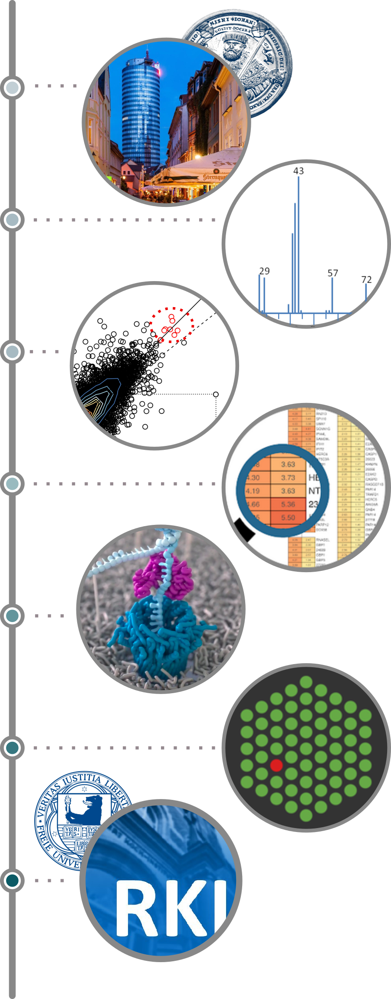

I teach the courses collected here. This page is a short introduction — who I
am and where my expertise comes from — so you have a sense of who is behind the
material. There is more on my [personal page](https://hoelzer.github.io/).

:::: {.columns}
::: {.column width="58%"}

## What I do

I am a researcher and team lead for **Bioinformatics and Translational
Research** at the Genome Competence Centre of the Robert Koch Institute in
Berlin, Germany's national public-health institute. My team studies infectious
diseases in a **One Health** context — bringing together real-time nanopore
sequencing, pangenomics, the analysis of environmental samples such as
wastewater, and the study of microbial evolution into bioinformatics for
genomic surveillance.

## How I got here

I studied Bioinformatics at the University of Jena (FSU) and stayed for a PhD,
specialising in **RNA bioinformatics and high-throughput sequencing analysis**.
I then joined the European Bioinformatics Institute (EMBL-EBI) in Hinxton, UK,
working in microbiome informatics, before moving to the Robert Koch Institute
in 2020, where I now lead my team.

The through-line is the one this teaching is built around: turning the text
that sequencing machines produce into biological and clinical answers.

:::
::: {.column width="42%"}

{fig-alt="A vertical career timeline running top to bottom, with a milestone image at each step: the city of Jena with the University of Jena seal, a mass-spectrometry spectrum, a gene-expression scatter plot, an expression heatmap under a magnifier, a nanopore threading a strand of DNA, a microarray, and the Robert Koch Institute." width="320"}

:::
::::
