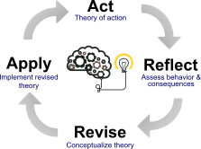

## Learning by doing

I believe students learn best by actively solving problems rather than passively consuming information. Lectures provide the foundations, but understanding develops through writing code, analysing data, discussing results, and reflecting on what worked—and what did not.

{#fig-teaching-model fig-alt="A circular diagram of four stages connected in a loop: Act (theory of action), Reflect (assess behaviour and consequences), Revise (conceptualize theory), and Apply (implement revised theory), around a central illustration of a brain full of gears connected to a lit light bulb." width="70%"}

The same cycle applies to the courses themselves. Each run is an experiment: what students struggle with feeds back into the material, and because everything is under version control, those revisions accumulate instead of being lost between semesters.

## Open and reproducible

Teaching should be as reproducible as research. Course material is written as plain text under version control and built with open tools, making it easy to improve, reuse, and keep up to date. The same source generates the slides, notes, and website, so everything stays in sync.

## Web-first, not PDF-first

Slides and notes are interactive HTML rather than static PDFs. They are searchable, work on any device, support live code and rich media, and can be updated instantly. Students who prefer a PDF can export one themselves, but I avoid maintaining parallel versions that inevitably diverge.

## Real tools for real problems

Bioinformatics and data science are practical disciplines. Students work with the same tools, workflows, and reproducible environments they are likely to encounter in research and industry. The goal is not only to teach specific software, but to develop the ability to approach new problems critically and independently.

## AI as a tool, not a shortcut

Modern AI tools are becoming part of scientific practice, so they also belong in the classroom. They can help explain code, explore ideas, or summarise information, but assessment focuses on understanding, reasoning, and reproducibility rather than generating polished output.

## Sustainable by design

Well-designed teaching infrastructure should disappear into the background. By investing in maintainable tools and automation, I can spend less time managing files and more time improving content, supporting students, and keeping courses current.
